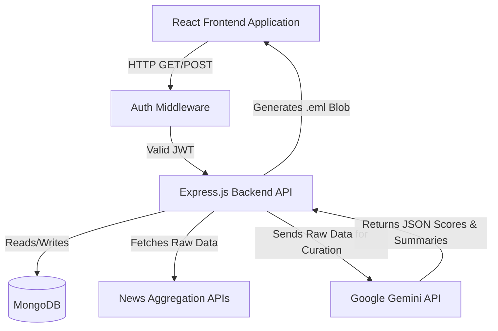

# System Architecture

## Core Components
The AI News Digest Portal relies on a highly modular, decoupled architecture consisting of four major components:

1. **Frontend Client (React SPA)**
   - Serves the user interface.
   - Manages localized state (Zustand) and server state caching (React Query).
   - Responsible for polling background tasks and enforcing UI-level validation.

2. **Backend API Server (Express.js)**
   - Acts as the central orchestrator.
   - Protects routes via JWT Middleware.
   - Delegates tasks to specific controllers and services.
   - Assembles the final `.eml` exports dynamically.

3. **Database Layer (MongoDB)**
   - Provides persistent storage for users, AI-curated articles, settings, and historical digest logs.

4. **External Services Integration Layer**
   - **News Providers**: REST integrations with NewsData.io, ApiTube, NewsAPI, and MediaStack to pull raw data.
   - **Cognitive Engine**: REST integration with Google Generative AI (Gemini) to evaluate raw data.

## Architectural Diagram

## Internal Backend Architecture
The backend strictly follows the **Controller-Service-Model** pattern:

1. **Routes**: Define endpoints and apply middleware (e.g., `/api/news/collect`).
2. **Controllers**: Handle HTTP Request/Response objects, extract parameters, and return JSON or Files. They contain the main orchestration logic.
3. **Services**: Abstract out heavy external API communication. For example, `aiService.js` strictly handles formatting prompts and communicating with Google Gemini, completely isolated from Express `req/res` objects.
4. **Models**: Define the structure of data saved to the database.

## Concurrency and Scaling
The most resource-intensive operation is `aiService.js`. Because Google Gemini imposes rate limits on requests, the architecture forces articles to be chunked into small batches (e.g., 5 articles per chunk). The backend iterates through these chunks sequentially rather than concurrently to prevent HTTP 429 (Too Many Requests) or 503 (Service Unavailable) errors from the Google API.
