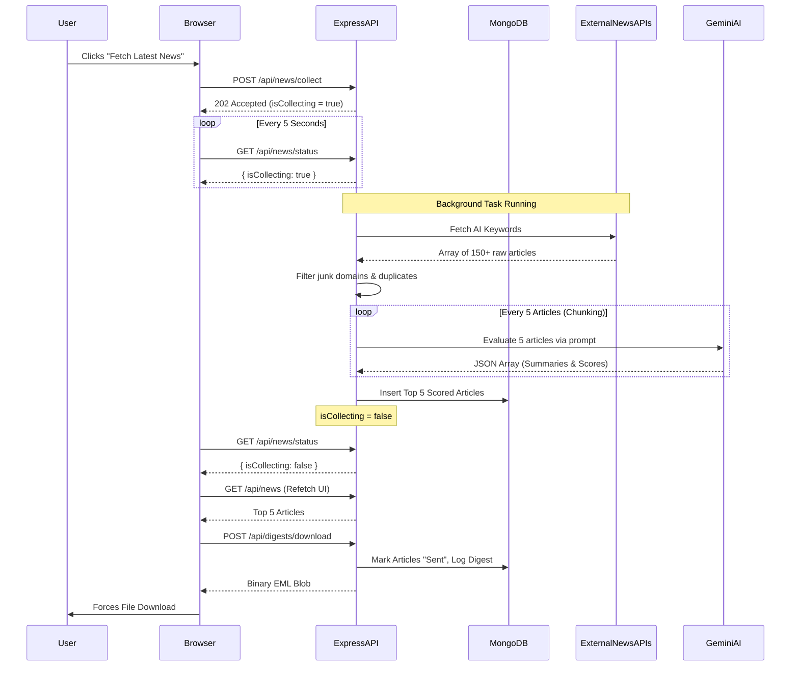
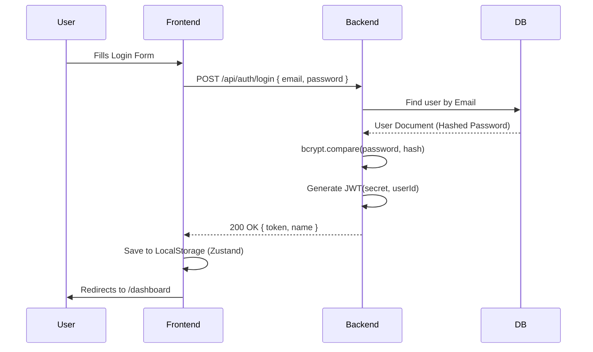

# Sequence Workflows (Mermaid)

## Application Polling & Curation Lifecycle

```mermaid
sequenceDiagram
    participant User
    participant Browser
    participant ExpressAPI
    participant MongoDB
    participant ExternalNewsAPIs
    participant GeminiAI

    User->>Browser: Clicks "Fetch Latest News"
    Browser->>ExpressAPI: POST /api/news/collect
    ExpressAPI-->>Browser: 202 Accepted (isCollecting = true)
    
    loop Every 5 Seconds
        Browser->>ExpressAPI: GET /api/news/status
        ExpressAPI-->>Browser: { isCollecting: true }
    end

    Note over ExpressAPI,ExternalNewsAPIs: Background Task Running
    ExpressAPI->>ExternalNewsAPIs: Fetch AI Keywords
    ExternalNewsAPIs-->>ExpressAPI: Array of 150+ raw articles
    ExpressAPI->>ExpressAPI: Filter junk domains & duplicates
    
    loop Every 5 Articles (Chunking)
        ExpressAPI->>GeminiAI: Evaluate 5 articles via prompt
        GeminiAI-->>ExpressAPI: JSON Array (Summaries & Scores)
    end
    
    ExpressAPI->>MongoDB: Insert Top 5 Scored Articles
    Note over ExpressAPI: isCollecting = false

    Browser->>ExpressAPI: GET /api/news/status
    ExpressAPI-->>Browser: { isCollecting: false }
    
    Browser->>ExpressAPI: GET /api/news (Refetch UI)
    ExpressAPI-->>Browser: Top 5 Articles
    
    Browser->>ExpressAPI: POST /api/digests/download
    ExpressAPI->>MongoDB: Mark Articles "Sent", Log Digest
    ExpressAPI-->>Browser: Binary EML Blob
    
    Browser->>User: Forces File Download
```

## Authentication Lifecycle

```mermaid
sequenceDiagram
    participant User
    participant Frontend
    participant Backend
    participant DB

    User->>Frontend: Fills Login Form
    Frontend->>Backend: POST /api/auth/login { email, password }
    Backend->>DB: Find user by Email
    DB-->>Backend: User Document (Hashed Password)
    Backend->>Backend: bcrypt.compare(password, hash)
    Backend->>Backend: Generate JWT(secret, userId)
    Backend-->>Frontend: 200 OK { token, name }
    Frontend->>Frontend: Save to LocalStorage (Zustand)
    Frontend->>User: Redirects to /dashboard
```
